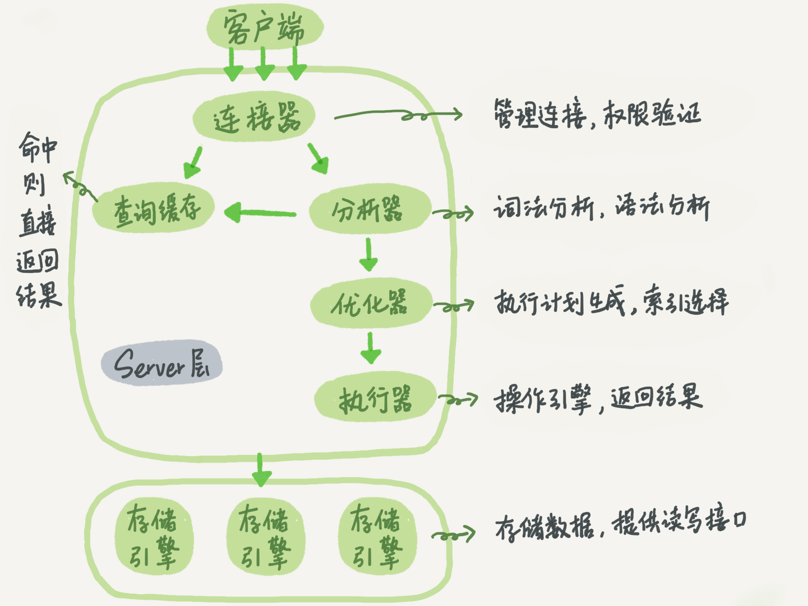

- 流程探索
```sql
mysql> SELECT * FROM T WHERE ID=10;
```

- MySQL 可分为 Server 层和 存储引擎 层两部分
- Server
  - 从连接器到执行器的部分
  - 核心
    - 连接器
    - 分析器
    - 优化器
    - 执行器
  - 查询缓存
  - 内置函数
  - 跨存储引擎功能
    - 存储过程
    - 触发器
    - 视图
- 存储引擎
  - 负责数据的存储和提取 
  - 最常见的为 InnoDB
- 不同的存储引擎共用一个 Server 层


# Server 层
- 连接器 [执行逻辑第一步]
  - 和客户端建立连接,获取权限,维持和管理连接
  - 连接命令常见写法:
    - ```sql
      mysql -h$IP -P$port -u$user -p
      ```
  - 登陆后使用 `show processlist` 查看连接
  - 数据库长时间无动静,`连接器`就会将其断开,时间由参数 `wait_timeout` 控制
  - 数据库长连接: 如果客户端持续有请求, 则一直使用同一个连接(尽量使用`长连接`)
    - 如何避免长连接累计产生的内存导致 OOM:
      - 定期断开长连接
      - 执行 `mysql_reset_connection` 重新初始化连接资源
  - 数据库短连接: 每次执行完很少的几个查询就断开连接,下次再重新连接

- 查询缓存 [执行逻辑第二步]
  - 弊大于利
  - 只有系统配置表这种不常更新的表使用查询缓存才有意义
  - 可以将参数 `query_cache_type` 设置成 `DEMAND`,这样对于默认的 SQL 语句不使用查询缓存,对想使用的语句使用 `SQL_CACHE` 显示指定
    - ```sql
      mysql> select SQL_CACHE * from T where ID=10;
      ```
  - MySQL `8` 开始直接删除了查询缓存功能

- 分析器 [第三步: 开始真正执行语句]
  - 词法分析
    - 字符串分别是什么,代表什么
    - select 是一个查询语句,所以将 T 识别为 `表名 T`, 字符串 ID 识别为 `列 ID`
  - 语法分析
    - 根据语法规则判断这一 SQL 语句是否符合 MySQL 语法

- 优化器 [第四步]
  - 当表中有`多个索引`时,决定使用哪个索引
  - 当一个语句有`多个表关联(join)`时,决定各个表的连接顺序
    - ```sql
      mysql> select * from t1 join t2 using(ID)  where t1.c=10 and t2.d=20;
      ```
    - 既可以先从表 t1 里面取出 c=10 的记录的 ID 值，再根据 ID 值关联到表 t2，再判断 t2 里面 d 的值是否等于 20
    - 也可以先从表 t2 里面取出 d=20 的记录的 ID 值，再根据 ID 值关联到 t1，再判断 t1 里面 c 的值是否等于 10
  - 优化器阶段完成后,语句的执行方案就确定下来了

- 执行器 [第五步]
  - 先判断权限
    - 在工程实现上，如果命中查询缓存，会在查询缓存返回结果的时候，做权限验证。查询也会在优化器之前调用 precheck 验证权限
  - 如果有权限,就打开表继续执行.打开表的时候,执行器就会根据表的引擎定义,去使用这个引擎提供的接口
  - 为什么不在优化器之前查询权限?
    - 就比如表中有触发器,这是在优化之前无法鉴权的

# 存储引擎 层
