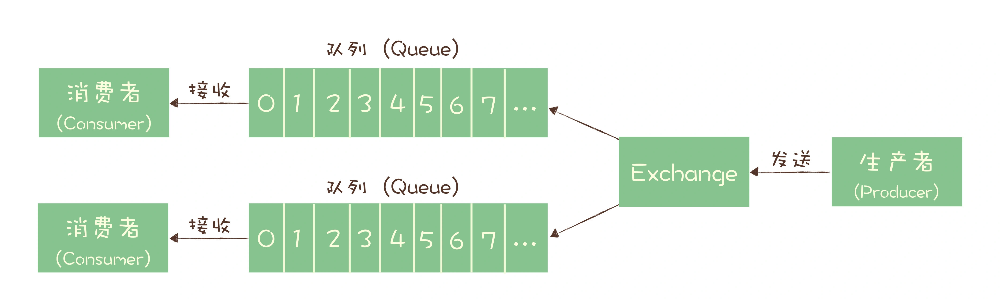
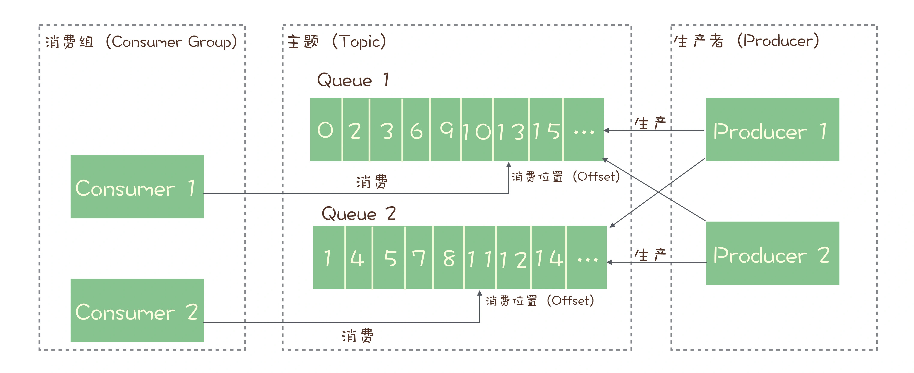

# 为什么需要消息队列

- 作为三大基础中间件中重要的一环,其重要性是不需要被证明的,`为什么需要`这个标题只是为了引出`解释其作用`

## 消息队列可以解决的问题
#### 主要
1. 异步处理
  - 秒杀系统(如何利用有限的服务器资源，尽可能多地处理短时间内的海量请求)
    - 将多个步骤拆解,优先解决核心业务,将可以延后处理的业务塞入`消息队列`
      - 更快返回结果
      - 减少等待,提升性能
2. 流量控制
  - 使用`消息队列`隔离网关和后端
    - 实现流量控制以及保护后端服务
    - 可以根据下游的能力自动调节流量,达到`削峰填谷`
  - 简单实现:令牌桶
    - 用`固有容量的消息队列`+`令牌发生器`实现
      - 网关只有在领到令牌后才能调用服务,消息队列只需要分发令牌
3. 服务解耦
  - 电商系统(一个消息需要被多个下游系统使用)
    - 订单服务在订单变化时发送一条消息到消息队列的一个主题 Topic 中，所有下游系统都订阅主题 Topic，这样每个下游系统都可以获得一份实时完整的订单数据(可通过 Topic 优化为只获取特定部分消息)

#### 还有
1. 作为发布/订阅系统实现微服务级系统间的观察模式
2. 连接流计算任务和数据
3. 将消息广播给大量订阅者

# 常见的消息队列
## RabbitMQ
- Erlang 编写
- 支持 AMQP 协议
- 轻量级,开箱即用
- 特色 Exchange 模块
  - 作用类似交换机
  - 根据配置的路由规则将生产者发出的消息分发到不同的队列中
- 使用 `队列模型 + Exchange`

## RocketMQ
- Java 编写
- 阿里开源
- 针对在线业务响应时延有优化,性能高
- 使用 `发布/订阅模型` + `主题下队列`
  - 每个主题包含多个队列，通过多个队列来实现多实例并行生产和消费
  - RocketMQ 只在队列上保证消息的有序性，主题层面是无法保证消息的严格顺序的

## Kafka
- Scala + Java 开发
- LinkedIn 开发
- 异步收发性能高于前两者,但不太适合在线业务场景
- 使用 `发布/订阅模型` + `主题下分区`(分区 Partition 等于 RocketMQ 中提到的队列)

## Pulsar
- Java 编写
- Yahoo 开源
- 存算分离

# 消息队列基本概念
## 架构层
- Broker
  - 本质为一个进程
  - 通常一个物理节点起一个进程,认为 Broker 就表示一个节点
- Topic
  - 通常表示组织分区关系的逻辑概念
- Partition/Queue/MessageQueue
  - 分区
  - 数据存储的最小单位
  - 可以将消息直接写入分区,也可以将其写入 Topic,再分发到某个分区
- Producer
  - 消息生产者
- Consumer
  - 消息消费者
- ConsumerGroup/Subscription
  - 组织消费者和分区关系的逻辑
- Message
  - 消息
- Offset/ConsumerOffset/Cursor
  - 消费者消费分区的进度
- ACK/OffsetCommit
  - 提交消费进度
- Leader/Follower
  - 主从副本
- Segment/Ledger
  - 数据分为多个文件存储时的文件
- StartOffset/EndOffset
  - 一个可写入/消费的动态变化区间
- ACL
  - Access Control List

## 功能层
- 顺序消息
- 延时消息/定时消息
- 事务消息
  - 原子
- 消息重试
- 消息回溯
- 广播消费
- 死信队列
- 优先级队列
- 消息过滤
- 消息过期/删除
- 消息轨迹
  - 记录一条消息从生产端发送、服务端保存、消费端消费的全生命周期的流程信息
- 消息查询
- 消息压缩
- 多租户
  - 同一个集群是否有逻辑隔离，比如一个物理集群能否创建两个名称都为 test 的主题
- 消息持久化
- 消息流控

---

# 参考
- [深入拆解消息队列 47 讲](https://time.geekbang.org/column/intro/100552001?tab=catalog)
- [消息队列高手课](https://time.geekbang.org/column/intro/100032301?tab=catalog)
