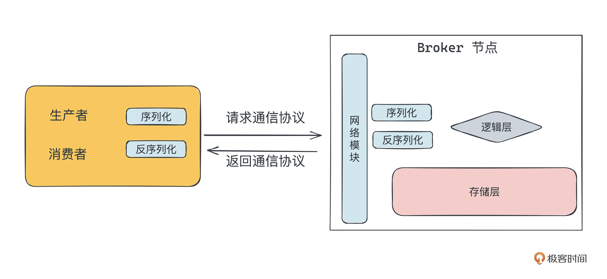

# 通信协议
- 用来完成客户端(生产者以及消费者)与 Broker 之间的通信

### 要求
- 可靠性高,不丢数据
- 性能高,时延低
- 内容精简,带宽利用率高
- 具备可扩展性,方便功能的增减

### 公有协议 / 私有协议
- 公有: 公开的受到认可的具有规范的协议
  - JMS, HTTP, STOMP
- 私有: 根据自身的功能和需求设计的协议
  - Kafka、RocketMQ、Puslar 的协议都是私有协议
  - 设计私有协议需完成
    - 网络通信协议选型
      - TCP
    - 应用通信协议设计
      - 极简,向后兼容,协议版本管理
      - 分为请求协议和返回协议
      - 协议应该包含协议头和协议体
        - 协议头主要包含一些通用的信息
        - 协议体包含请求维度的信息
    - 编解码实现
      - 序列化和反序列化

# 网络模块
- 客户端用来发送数据，服务端用来接收数据

### 要求
- 高效的连接管理
- 快速处理高并发请求
- 大流量快速吞吐

### 高性能设计实现
- `基于多路复用技术管理 TCP 连接`
  - IO 多路复用技术
    - 解决`高效的连接管理`
    - 连接有上限
      - 受系统 FD 数量限制 + 系统资源限制(CPU/内存)

- `基于 Reactor 模型处理高并发请求`
  - 三种实现
    - 单 Reactor 单线程模型（单 Reactor 单线程）
    - 单 Reactor 多线程模型 （单 Reactor 多线程）
    - 主从 Reactor 多线程模型 `(多 Reactor 多线程)`
  - 业界消息队列的网络模型,比如 Pulsar、Kafka、RocketMQ,为了保证性能,都是基于主从 Reactor 多线程模型开发的
  - 主线程只负责接收新连接,子线程负责完成后续的业务处理

### 主流消息队列网络模型
- Kafka
  - Java NIO
- RocketMQ
  - Netty
- 最新发展
  - RPC

# 存储模块
- 服务端用来完成持久化数据存储

### 要求
- 实现基础功能
- 优化性能

### 元数据存储
- 第三方组件(主流选择)
  - Kakfa 和 Pulsar 的元数据存储在 ZooKeeper 中
  - RocketMQ 存在 Broker+Zookeeper 
  - etcd
- 集群内部实现
  - 运维部署成本低,开发成本高

### 消息数据存储
- Topic 与 Group 不承担数据存储功能,承担逻辑组织功能
- 实际存储完成在`分区维度`
- 数据落盘存储有两种思路
  - (下方所指“文件”是一个虚指,即表示所有分区的数据是存储在一起,还是每个分区的数据分开存储的意思)
  - 每个分区单独存储一个`文件`
    - 大部分情况读写有序,读写性能最高
      - 当文件很多,硬盘如果产生随机读写,性能会严重下降
    - 会占用太多 FD 资源
    - Kafka 在存储数据的组织上用的就是这个思路
  - 每个分区所有数据存在同一个`文件`
    - 写入性能很高,读取性能不高
    - 维护简单,不占用过多 FD 资源
    - RocketMQ、RabbitMQ 和 Pulsar 的底层存储 BookKeeper 用的就是这个方案
- 消息数据的分段实现
  - 根据偏移量定位
  - 根据索引定位
- 清理机制
  - 自动删除 / 手动删除
  - 三种实现思路
    - 消费完成执行 ACK 删除数据
      - RabbitMQ
    - 根据时间和保留大小删除
      - Kafka / RocketMQ
    - ACK 机制和过期机制相结合
      - Pulsar
  - 主流思路:延时删除,以段数据为单位清理

### 提高写入性能
- 写入优化围绕 `内存+硬盘` 展开
  - 缓存写 + 批量写
    - 将数据先写入内存,攒够一批后再批量刷到硬盘中
      - 按空间占比刷新
        - 脏数据在内存中的占比(dirty_background_ratio)
        - 脏数据的绝对字节数(dirty_background_bytes) [优先级更高]
      - 按时间周期刷新
      - 程序手动强制刷新
  - 随机写和顺序写
    - 顺序读写的效率高于随机读写

### 提高写入可靠性
- 同步刷盘
  - 效率低,但可优化
  - 主流数据库均支持
- WAL
  - Write-Ahead Logging
  - 预写式日志
  - Pulsar 支持
- 多副本备份
  - 针对分布式情况
  - 将数据拷贝到多台节点,每台节点都写入到内存中,从而完成数据的可靠性存储
  - Kakfa RabbitMQ RocketMQ 支持

### 提高读取操作的性能
- 冷读热读
- 顺序读,随机读,批量读
- 零拷贝
  - 通过 DMA 搬运数据
    - Direct Memory Access
  - mmap+write 或 sendfile

### 通过硬件和系统调用提升性能

# 生产者
- 完成生产相关的功能

### 客户端基础功能
- 连接管理
- 心跳检测
- 错误处理
- 重试机制

### 生产相关功能
- 客户端寻址机制
  - Metadata 寻址机制
  - 服务端内部转发机制
    - 不适合大流量, Server 压力太大
- 生产分区分配策略
  - 轮询
  - 按 Key Hash
  - 手动指定
- 批量语义

### 输出发送方式
- 同步发送
- 异步发送
- 发送即忘

### 集群管控操作
- 命令行
- 客户端
- HTTP 接口

### summary
- 网络模块的开发和管理
  - 这部分是为了完成和服务端的通信，比如请求和返回的构建、心跳检测、错误处理，重试机制等
- 根据服务端提供的各个接口的协议结构，构建请求，完成序列化和反序列化后，通过网络模块发起请求并获得返回
- 在前面两步的基础上，添加各个业务层面的功能，比如生产、消费、事务、幂等、SSL 等等

# 消费者
- 完成消费相关的功能

### 消费模型选择
- Pull
  - 主流
- Push
  - 及时性高
- Pop
  - 本质是 Pull 的一种

### 分区消费模式的设计
- 独占消费
  - 一个分区在同一个时间只能被一个消费者消费
- 共享消费
  - 单个分区的数据可以被多个消费者消费
- 广播消费
  - 一条数据可以被多个消费者消费
- 灾备消费
  - 在保持独占消费可以支持顺序消费的基础上,同时加入灾备的消费者

### 消费分组
- 在消费端有消费分组这一概念,在 Broker 有 Topic 这一概念
- 消费分组与 Topic 强相关

### 协调者
- 一个单独模块
- 主要执行消费重平衡+记录消费进度

### 消费分区分配策略
- 轮询
- 粘性
- 自定义

### 消费确认
- 确认后删除数据
- 确认后保存消费进度
  - 数据的删除交给数据过期策略执行
  - 消费角度的保存:
    - 服务端保存
      - 自动提交
      - 手动提交
    - 客户端自定义保存

### 消费失败处理
- 从服务端拉去数据失败
- 本地业务数据处理失败
  - 重试
  - 死信队列
- 提交位点信息失败

### summary
- 满足基本的消费需求，能消费到数据，确认数据
- 满足稳定性和性能的需求，能快速稳定地消费到数据
- 支持功能方面的需求，比如回溯消费、消费删除、广播消费等等